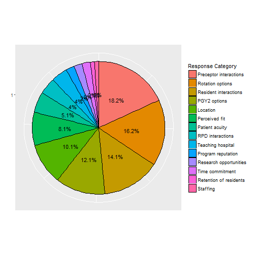
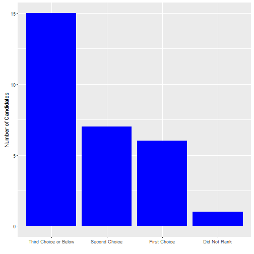

PGY1 Residency Interviews Feedback Survey
========================================================
author: Brian Gulbis
date: April 19, 2016
autosize: true

Survey Overview
========================================================

* Survey was sent to all 35 candidates who interviewed
* There were 29 candidates who completed the survey
    - Response rate of 82.9%

Questions Asked
========================================================

* When researching residency programs, how did you first learn about the PGY1 residency program at Memorial Hermann-Texas Medical Center?
* What factors were most important to you when deciding what order to rank residency programs?
* How would you rate each of these components of your interview day?
    - Residency Program Director interactions
    - Preceptor interactions
    - Resident interactions
    - Multiple Mini Interviews
    - Lunch
    - Tour

Questions Asked
========================================================

* Did the use of the Multiple Mini Interview format influence the way you ranked our residency program?
* Where did you rank Memorial Hermann-Texas Medical Center?
* If Memorial Hermann-Texas Medical Center was not your first choice, what was the primary reason (or reasons) why?
* Please provide any suggestions you have to improve the interview process at Memorial Hermann-Texas Medical Center for next year's residency candidates.

Question 1
========================================================

Question 2
========================================================

Question 3
========================================================
**Ratings of each component of the interview day**

|              |Lunch     |MMI       |Preceptor |Resident  |RPD       |Tour      |
|:-------------|:---------|:---------|:---------|:---------|:---------|:---------|
|n             |29        |29        |29        |29        |29        |29        |
|Score (%)     |          |          |          |          |          |          |
|Poor          |0 ( 0.0)  |0 ( 0.0)  |0 ( 0.0)  |1 ( 3.4)  |0 ( 0.0)  |1 ( 3.4)  |
|Below Average |0 ( 0.0)  |1 ( 3.4)  |0 ( 0.0)  |3 (10.3)  |2 ( 6.9)  |1 ( 3.4)  |
|Average       |15 (51.7) |8 (27.6)  |7 (24.1)  |4 (13.8)  |10 (34.5) |6 (20.7)  |
|Above Average |8 (27.6)  |15 (51.7) |11 (37.9) |11 (37.9) |4 (13.8)  |7 (24.1)  |
|Excellent     |6 (20.7)  |5 (17.2)  |11 (37.9) |10 (34.5) |13 (44.8) |14 (48.3) |

Question 4
========================================================

Question 5
========================================================

Question 6
========================================================

Question 7
========================================================

